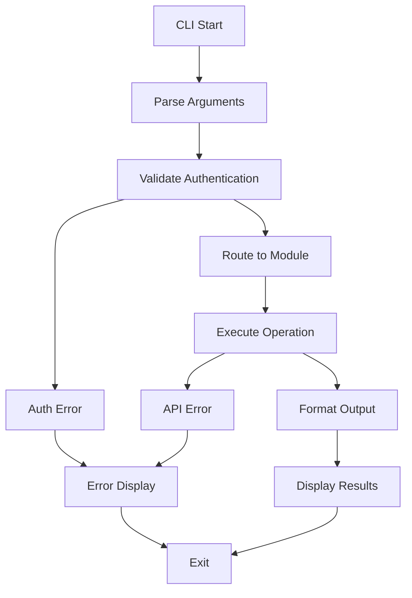

# Planning Center CLI Tool - Product Requirements Document

## 1. Product Overview

A comprehensive command-line interface (CLI) tool that provides easy access to all Planning Center API modules using Personal Access Token authentication. The tool enables users to query, investigate, and retrieve data from all Planning Center services through intuitive command-line arguments and extensive filtering options.

This CLI tool serves as both a practical utility for administrators and developers, and as a comprehensive example demonstrating the traditional API interfaces across all Planning Center modules. It addresses the need for quick data access, debugging, and administrative tasks without requiring a full application interface.

## 2. Core Features

### 2.1 User Roles

| Role | Authentication Method | Core Permissions |
|------|----------------------|------------------|
| CLI User | Personal Access Token (PAT) | Full read access to all modules based on PAT permissions |
| Administrator | PAT with admin privileges | Enhanced access to administrative data and bulk operations |

### 2.2 Feature Module

Our Planning Center CLI tool consists of the following main components:

1. **Authentication Module**: PAT-based authentication, credential management, and validation
2. **Module Router**: Dynamic routing to appropriate service interfaces based on module selection
3. **Query Engine**: Advanced filtering, sorting, and pagination handling across all modules
4. **Output Formatter**: Multiple output formats (JSON, table, CSV) with customizable display options
5. **Configuration Manager**: Settings management, default parameters, and user preferences
6. **Help System**: Comprehensive help documentation and command discovery
7. **Error Handler**: Robust error handling with detailed diagnostics and troubleshooting guidance

### 2.3 Page Details

| Module Name | Service Interface | Feature Description |
|-------------|------------------|--------------------|
| Authentication Module | PersonalAccessTokenAuthenticator | Validate PAT credentials, test authentication, display current user info |
| People Module | IPeopleService | List people, get person details, search by name/email, filter by status/membership |
| Services Module | IServicesService | List service plans, get plan details, list team members, get service types |
| Registrations Module | IRegistrationsService | List events, get event details, list signups, get attendee information |
| Calendar Module | ICalendarService | List calendar events, get event details, list resources, filter by date range |
| CheckIns Module | ICheckInsService | List check-in events, get attendance data, list locations, get check-in statistics |
| Giving Module | IGivingService | List donations, get donor information, list campaigns, get giving statistics |
| Groups Module | IGroupsService | List groups, get group details, list members, get group types |
| Publishing Module | IPublishingService | List episodes, get media content, list series, get publishing statistics |
| Webhooks Module | IWebhooksService | List webhook subscriptions, get event history, list available events |
| Query Engine | QueryParameters | Apply filters, sorting, pagination, field selection, relationship inclusion |
| Output Formatter | Multiple formats | Display data in JSON, table, CSV formats with customizable columns |
| Configuration Manager | Settings persistence | Save/load user preferences, default parameters, output format settings |
| Help System | Command documentation | Interactive help, command examples, parameter descriptions |
| Error Handler | Exception management | Handle API errors, network issues, authentication failures with clear messages |

## 3. Core Process

### Main User Flow

1. **Authentication**: User provides PAT via environment variable, command argument, or configuration file
2. **Module Selection**: User specifies which Planning Center module to query (people, services, etc.)
3. **Operation Selection**: User chooses the specific operation (list, get, search)
4. **Parameter Configuration**: User applies filters, sorting, pagination, and output formatting options
5. **Data Retrieval**: CLI executes API calls using traditional service interfaces
6. **Result Display**: Data is formatted and displayed according to user preferences
7. **Error Handling**: Any errors are caught and displayed with helpful troubleshooting information

### Command Structure Flow



## 4. User Interface Design

### 4.1 Design Style

- **Color Scheme**: Terminal-friendly colors with support for both light and dark themes
- **Typography**: Monospace fonts for data display, clear hierarchy for headers and sections
- **Layout Style**: Clean tabular output with proper alignment and spacing
- **Icons**: Unicode symbols for status indicators (✓, ✗, ⚠, ℹ)
- **Interactive Elements**: Progress indicators for long operations, colored output for different data types

### 4.2 Command Interface Design

| Component | Interface Elements | Design Details |
|-----------|-------------------|----------------|
| Main Command | `pcli [module] [operation] [options]` | Clear hierarchical structure with module-first approach |
| Help System | `--help`, `-h` flags | Contextual help at every level with examples and parameter descriptions |
| Output Formatting | `--format`, `--columns`, `--no-header` | Flexible output options for different use cases |
| Filtering | `--filter`, `--where`, `--search` | Intuitive filtering syntax matching API capabilities |
| Pagination | `--page`, `--per-page`, `--all` | Control over data retrieval with performance considerations |
| Authentication | `--token`, environment variables | Secure credential handling with multiple input methods |
| Verbosity | `--verbose`, `--quiet`, `--debug` | Adjustable output levels for different scenarios |

### 4.3 Responsiveness

The CLI tool is designed to be terminal-agnostic and works across different terminal sizes and capabilities. It includes:
- Automatic column width adjustment based on terminal size
- Responsive table formatting that adapts to available space
- Support for both interactive and non-interactive (scripting) usage
- Cross-platform compatibility (Windows, macOS, Linux)

## 5. Technical Architecture

### 5.1 Project Structure
```
PlanningCenter.Api.Client.CLI/
├── Commands/
│   ├── BaseCommand.cs
│   ├── PeopleCommands.cs
│   ├── ServicesCommands.cs
│   ├── RegistrationsCommands.cs
│   ├── CalendarCommands.cs
│   ├── CheckInsCommands.cs
│   ├── GivingCommands.cs
│   ├── GroupsCommands.cs
│   ├── PublishingCommands.cs
│   └── WebhooksCommands.cs
├── Services/
│   ├── ICliService.cs
│   ├── CliService.cs
│   ├── IOutputFormatter.cs
│   ├── OutputFormatter.cs
│   ├── IConfigurationManager.cs
│   └── ConfigurationManager.cs
├── Models/
│   ├── CliOptions.cs
│   ├── OutputFormat.cs
│   └── CommandResult.cs
├── Extensions/
│   ├── ServiceCollectionExtensions.cs
│   └── QueryParametersExtensions.cs
├── Program.cs
├── PlanningCenter.Api.Client.CLI.csproj
└── README.md
```

### 5.2 Command Examples

```bash
# List all people with pagination
pcli people list --per-page 25 --format table

# Get specific person details
pcli people get --id 12345 --format json

# Search people by name
pcli people list --search "John Smith" --format csv

# List service plans for current month
pcli services list --filter "created_at>=2024-01-01" --sort "created_at desc"

# Get all registrations for a specific event
pcli registrations list --filter "event_id=67890" --all

# List calendar events in date range
pcli calendar events --start-date 2024-01-01 --end-date 2024-01-31

# Get giving statistics
pcli giving donations --filter "amount>=100" --format table --columns "amount,donor_name,date"

# List webhook subscriptions
pcli webhooks subscriptions --format json --verbose
```

### 5.3 Implementation Phases

**Phase 1: Core Infrastructure**
- Project setup and dependency injection
- Authentication and configuration management
- Base command structure and argument parsing
- Output formatting foundation

**Phase 2: Primary Modules**
- People module commands
- Services module commands
- Basic filtering and pagination
- Table and JSON output formats

**Phase 3: Extended Modules**
- Registrations, Calendar, CheckIns modules
- Advanced filtering and search capabilities
- CSV output format and custom column selection

**Phase 4: Advanced Features**
- Giving, Groups, Publishing, Webhooks modules
- Bulk operations and streaming support
- Configuration persistence and user preferences
- Comprehensive error handling and diagnostics

**Phase 5: Polish and Documentation**
- Interactive help system
- Performance optimizations
- Comprehensive testing
- Documentation and examples

### 5.4 Dependencies

- **CommandLineParser**: For robust argument parsing and help generation
- **Microsoft.Extensions.DependencyInjection**: For service registration and dependency management
- **Microsoft.Extensions.Configuration**: For configuration management
- **Microsoft.Extensions.Logging**: For diagnostic logging
- **ConsoleTables**: For formatted table output
- **Newtonsoft.Json**: For JSON formatting and manipulation
- **CsvHelper**: For CSV output generation

This CLI tool will serve as a comprehensive example of using the Planning Center API's traditional service interfaces while providing practical utility for administrators and developers working with Planning Center data.