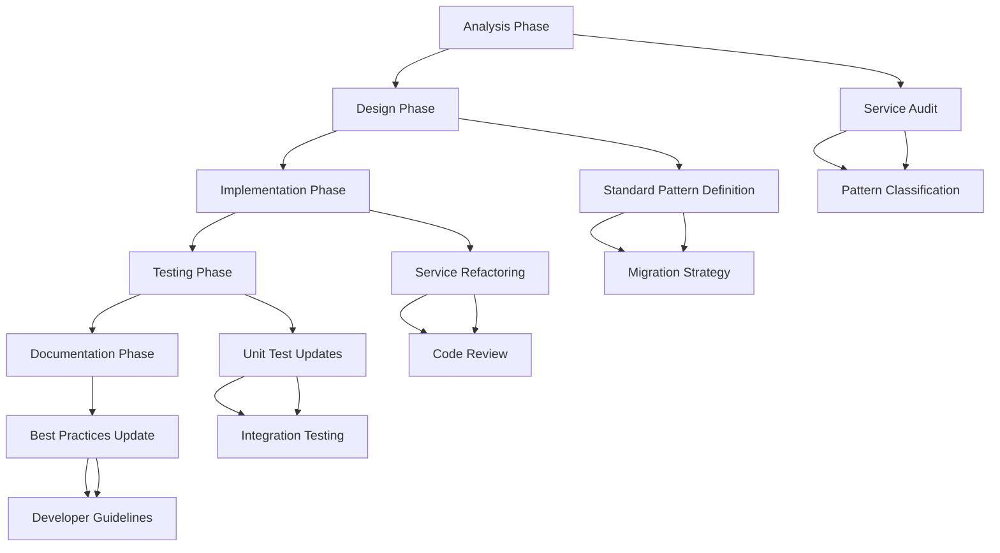

# ServiceBase GetResourceById Standardization Plan

## 1. Product Overview

This plan outlines the strategy to standardize the usage of `GetResourceByIdAsync` from `ServiceBase` across all API services in the Planning Center API Library. The goal is to improve consistency, reduce code duplication, and enhance error handling across all service implementations.

## 2. Core Features

### 2.1 Current State Analysis

Based on the codebase analysis, we have identified the following patterns:

**Services Currently Using GetResourceByIdAsync:**

* `PeopleService`: Directly uses `ServiceBase.GetResourceByIdAsync`

* `TraditionalApiServiceBase`: Uses `GetResourceByIdAsync` in `GetByIdAsync` method

**Services Using Alternative Patterns:**

* `GivingService`: Uses `ExecuteGetAsync` and direct `ApiConnection.GetAsync` calls

* `CalendarService`: Uses `ExecuteGetAsync` and direct `ApiConnection.GetAsync` calls

### 2.2 Feature Module

Our standardization plan consists of the following main phases:

1. **Analysis Phase**: Complete audit of all service implementations
2. **Design Phase**: Create standardized patterns and guidelines
3. **Implementation Phase**: Refactor services to use consistent patterns
4. **Testing Phase**: Ensure all changes maintain functionality
5. **Documentation Phase**: Update guidelines and best practices

### 2.3 Page Details

| Phase Name           | Module Name                 | Feature Description                                                                                                          |
| -------------------- | --------------------------- | ---------------------------------------------------------------------------------------------------------------------------- |
| Analysis Phase       | Service Audit               | Identify all services and their current "get by ID" implementations. Document patterns, inconsistencies, and technical debt. |
| Analysis Phase       | Pattern Classification      | Categorize services by their current implementation approach (GetResourceByIdAsync, ExecuteGetAsync, direct API calls).      |
| Design Phase         | Standard Pattern Definition | Define the recommended pattern using ServiceBase.GetResourceByIdAsync with proper error handling and logging.                |
| Design Phase         | Migration Strategy          | Create step-by-step approach for refactoring each service type while maintaining backward compatibility.                     |
| Implementation Phase | Service Refactoring         | Refactor GivingService, CalendarService, and other services to use GetResourceByIdAsync consistently.                        |
| Implementation Phase | Code Review                 | Ensure all refactored code follows established patterns and maintains existing functionality.                                |
| Testing Phase        | Unit Test Updates           | Update existing unit tests to reflect new implementation patterns.                                                           |
| Testing Phase        | Integration Testing         | Verify that refactored services maintain API compatibility and functionality.                                                |
| Documentation Phase  | Best Practices Update       | Update coding guidelines to mandate GetResourceByIdAsync usage for resource retrieval.                                       |
| Documentation Phase  | Developer Guidelines        | Create clear examples and documentation for future service implementations.                                                  |

## 3. Core Process

### Phase 1: Analysis and Planning

1. Complete audit of all service implementations
2. Document current patterns and identify inconsistencies
3. Assess impact and complexity of changes
4. Create detailed migration plan for each service

### Phase 2: Design and Standards

1. Define standardized GetResourceByIdAsync usage pattern
2. Create coding guidelines and best practices
3. Design backward compatibility strategy
4. Plan testing approach

### Phase 3: Implementation

1. Refactor GivingService to use GetResourceByIdAsync
2. Refactor CalendarService to use GetResourceByIdAsync
3. Update any other services with inconsistent patterns
4. Ensure all services follow the same error handling approach

### Phase 4: Testing and Validation

1. Update unit tests for refactored services
2. Run integration tests to ensure functionality
3. Perform code review and quality assurance
4. Validate performance impact

### Phase 5: Documentation and Guidelines

1. Update developer documentation
2. Create examples and best practices
3. Update coding standards
4. Train team on new patterns

## 4. User Interface Design

### 4.1 Design Style

This is a backend refactoring project with no UI components. The focus is on:

* **Code Consistency**: Uniform patterns across all services

* **Error Handling**: Standardized exception handling and logging

* **Developer Experience**: Clear, predictable API patterns

* **Documentation Style**: Clear, comprehensive guidelines with examples

* **Testing Approach**: Thorough unit and integration test coverage

### 4.2 Implementation Design Overview

| Phase Name           | Module Name         | Implementation Details                                                                                                              |
| -------------------- | ------------------- | ----------------------------------------------------------------------------------------------------------------------------------- |
| Analysis Phase       | Service Audit       | Use automated tools and manual review to catalog all service implementations. Create spreadsheet tracking current patterns.         |
| Design Phase         | Standard Pattern    | Define template: `return await GetResourceByIdAsync<TDto, TDomain>(id, endpoint, mapper, operationName, cancellationToken);`        |
| Implementation Phase | Service Refactoring | Replace custom implementations with standardized GetResourceByIdAsync calls. Maintain existing method signatures for compatibility. |
| Testing Phase        | Test Updates        | Update mocks and test cases to reflect new implementation while maintaining same test coverage levels.                              |
| Documentation Phase  | Guidelines          | Create markdown documentation with code examples, do's and don'ts, and migration guides.                                            |

### 4.3 Backward Compatibility

All changes must maintain backward compatibility:

* Public method signatures remain unchanged

* Same return types and exception handling behavior

* No breaking changes to existing API contracts

* Gradual migration approach allows for rollback if needed

